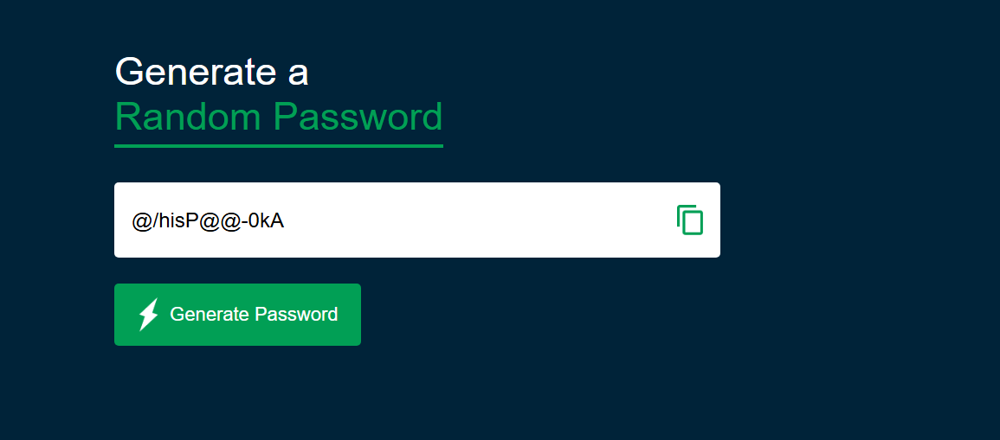

# 🔐 Password Generator App

A simple and responsive password generator built with HTML, CSS, and JavaScript. It allows users to generate secure passwords containing uppercase letters, lowercase letters, numbers, and symbols—with the option to copy the password to the clipboard with a single click.

---

## 📸 Screenshot



---

## 🚀 Features

- ✅ Generates secure 12-character passwords
- ✅ Includes uppercase, lowercase, numbers, and symbols
- ✅ Automatically shuffles characters for better randomness
- ✅ Copy to clipboard functionality
- ✅ Simple, clean, and mobile-friendly UI

---

## 🛠️ Technologies Used

- HTML
- CSS
- JavaScript

---
## 🔐 Random Password Generator HTML Structure

This HTML sets up the user interface for generating and copying random passwords.

```html
<!DOCTYPE html>
<html>

<head>
  <meta name="viewport" content="width=device-width, initial-scale=1.0">
  <title>Random Password Generator</title>
  <link rel="stylesheet" href="style.css"> <!-- Your CSS file -->
</head>

<body>
  <div class="container">
    <h1>Generate a <br><span>Random Password</span></h1>

    <!-- Password display with copy button -->
    <div class="display">
      <input type="text" id="password" placeholder="Password" readonly>
      
      <span id="copy-msg" style="margin-left: 10px; color: green; display: none;">Copied!</span>
    </div>

    <!-- Button to generate a new password -->
    <button id="generate">
       Generate Password
    </button>
  </div>
<script>javascript code logic</script>
</body>
</html>
```
## 🔐 Random Password Generator Logic (JavaScript)

This JavaScript app generates strong random passwords using uppercase letters, lowercase letters, numbers, and symbols. It includes functionality to copy the generated password to the clipboard.

```javascript
// Select the password input box
const passwordBox = document.getElementById('password');
const length = 12; // Desired password length

// Character sets for the password
const upperCase = 'ABCDEFGHIJKLMNOPQRSTUVWXYZ';
const lowerCase = 'abcdefghijklmnoprstuvwxyz';
const number = '0123456789';
const symbol = '@#$%^&*()_+|}{[]></-=';

// Function to generate a random password
function generateRanPassword() {
  const allChars = upperCase + lowerCase + number + symbol;
  let password = '';

  // Ensure password includes at least one of each character type
  password += upperCase[Math.floor(Math.random() * upperCase.length)];
  password += lowerCase[Math.floor(Math.random() * lowerCase.length)];
  password += number[Math.floor(Math.random() * number.length)];
  password += symbol[Math.floor(Math.random() * symbol.length)];

  // Fill the rest of the password with random characters
  while (password.length < length) {
    password += allChars[Math.floor(Math.random() * allChars.length)];
  }

  // Optional: Shuffle the characters in the password for better randomness
  password = password.split('').sort(() => Math.random() - 0.5).join('');

  // Display the generated password
  passwordBox.value = password;
}

// Generate password when the button is clicked
document.getElementById('generate').addEventListener('click', generateRanPassword);

// Copy password to clipboard and show "Copied!" message
document.getElementById('copy').addEventListener('click', () => {
  const password = document.getElementById('password');
  const msg = document.getElementById('copy-msg');

  password.select(); // Highlight the password
  password.setSelectionRange(0, 9999); // For mobile devices

  navigator.clipboard.writeText(password.value)
    .then(() => {
      msg.style.display = 'inline'; // Show message

      setTimeout(() => {
        msg.style.display = 'none'; // Hide after 2 seconds
      }, 2000);
    })
    .catch(err => {
      console.error("Copy failed:", err);
    });
});
```

## 📂 Folder Structure
```
project-folder/
│
├── index.html # Main HTML file
├── style.css # Styling for the UI
├── script.js # JavaScript logic
└── images/ # Icons and assets
├── copy.png # Copy-to-clipboard icon
└── screenshot.png # App screenshot
```

---

## 📋 How to Use

1. Clone this repo:
   ```bash
   git clone https://github.com/your-username/random_password_generator_app.git
   ```
2. Navigate into the project folder:
  ```bash
cd password-generator
```
3. Open index.html in your browser.
4. Click "Generate Password" to get a secure password.
5. Click the copy icon to copy the password to your clipboard.

## 🙌 Contributions
Contributions, issues, and suggestions are welcome!
Feel free to fork the repository and submit a pull request.

## ✨ Author
Ellias Sithole
